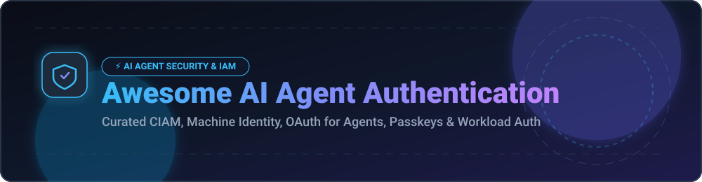

# 🤖 Awesome AI Agent Authentication 🛡️

  
  
  
  
  

---

> 🚀 **A curated directory of top-tier SaaS identity platforms and open-source authentication frameworks designed for AI Agents, Machine Identities, OAuth for Autonomous Agents, Passkeys, Workload Security, and Enterprise CIAM.**

---

## 📑 Table of Contents
- [🌐 Sector Market Overview & Market Size](#-sector-market-overview--market-size)
- [🏢 SaaS & Hosted Identity Platforms](#-saas--hosted-identity-platforms)
- [🔓 Open-Source Authentication Projects](#-open-source-authentication-projects)
- [🏗️ Recommended Architecture & Frameworks](#️-recommended-architecture--frameworks)
- [🤝 How to Contribute](#-how-to-contribute)
- [⚠️ Security Disclaimer](#️-security-disclaimer)
- [💖 Support & Sponsorship](#-support--sponsorship)
- [📈 Star History](#-star-history)

---

## 🌐 Sector Market Overview & Market Size

> 📊 **Market Insights**: The global Identity & Access Management (IAM) and Customer Identity Management (CIAM) market is estimated at **~$18.5 Billion to $22 Billion** (projected to reach **$35B+ by 2030**). 
> 
> 🏗️ **Market Dynamics**: The market is **moderately fragmented**. Established enterprise identity giants (e.g., Okta/Auth0) hold dominant market share in corporate SSO, while fast-growing developer platforms (WorkOS, Clerk, Stytch, Descope) and community-driven open-source systems (Keycloak, PocketBase, Ory) rapidly expand in AI agent token delegation, workload identities, and passkey authentication.

---

## 🏢 SaaS & Hosted Identity Platforms

*Commercial identity providers offering turnkey developer APIs, passkeys, multi-tenant B2B SSO, and non-human identity governance.*

| 🚀 SaaS Platform | 📝 Description | 💰 Company Size / Valuation | 🏷️ Starting Paid Tier | 🎁 Free Tier Limit |
| :--- | :--- | :--- | :--- | :--- |
| **[Auth0 / Okta CIAM](https://auth0.com/)** | Enterprise identity platform for app authentication, API security, and service accounts. | **~$13.5 Billion** *(Market Cap)* | **$23 / month** *(B2C Starter)* | **7,500 MAU** free forever |
| **[WorkOS](https://workos.com/)** | Enterprise-ready identity platform providing SSO, Directory Sync (SCIM), and RBAC for AI products. | **~$1.2 Billion** *(Valuation)* | **$125 / month** *(Per SSO Connection)* | **1,000 MAU** free for User Auth |
| **[Stytch](https://stytch.com/)** | API-first authentication platform with passkeys, device fingerprinting, and session security. | **~$1.0 Billion** *(Valuation)* | **$99 / month** *(Growth Tier + $0.005/MAU)* | **10,000 MAU** free forever |
| **[Clerk](https://clerk.com/)** | Developer-first CIAM offering user management, passkeys, 2FA, and organization multi-tenancy. | **~$500 Million** *(Est. Valuation)* | **$25 / month** *(Pro Base Plan)* | **10,000 MAU** free forever |
| **[Descope](https://descope.com/)** | Drag-and-drop visual authentication flows, delegated permissions, and fine-grained agent security. | **~$350 Million** *(Est. Valuation)* | **$299 / month** *(Production Pro)* | **7,500 MAU** free forever |
| **[FusionAuth](https://fusionauth.io/)** | Single-tenant customer identity provider available as hosted cloud or self-hosted deployment. | **~$150 Million** *(PE Valuation)* | **$49 / month** *(Cloud Starter)* | **Unlimited Users** *(Self-Hosted Community)* |
| **[Frontegg](https://frontegg.com/)** | End-to-end B2B SaaS customer identity platform with multi-tenant delegation for AI applications. | **~$120 Million** *(Est. Valuation)* | **$99 / month** *(Growth Plan)* | **5,000 MAU** free forever |
| **[Ory Network](https://www.ory.sh/)** | Managed cloud identity service built on open-source Ory stack (Kratos, Hydra, Keto, Oathkeeper). | **~$60 Million** *(Est. Valuation)* | **$29 / month** *(Express / Pro)* | **200 MAU** free forever *(Developer Tier)* |
| **[Hanko Cloud](https://www.hanko.io/)** | Cloud-managed passkey & WebAuthn authentication service optimized for modern web & agent apps. | **~$15 Million** *(Est. Valuation)* | **$29 / month** *(Cloud Pro)* | **10,000 MAU** free forever |

---

## 🔓 Open-Source Authentication Projects

*Battle-tested open-source identity providers, workload authentication engines, and lightweight OAuth2 frameworks for AI backends.*

| 📦 Open-Source Project | ⭐ GitHub Stars_Badge | 📜 License | ℹ️ Overview |
| :--- | :--- | :--- | :--- |
| **[PocketBase](https://github.com/pocketbase/pocketbase)** |  | `MIT` | Open-source Go backend in 1 file with built-in user authentication, real-time database, and admin UI. |
| **[Appwrite](https://github.com/appwrite/appwrite)** |  | `BSD-3-Clause` | Open-source backend-as-a-service providing auth, databases, OAuth2 providers, and serverless functions. |
| **[Keycloak](https://github.com/keycloak/keycloak)** |  | `Apache-2.0` | Leading enterprise IAM server supporting SSO, OIDC/SAML, service accounts, and LDAP identity federation. |
| **[Better Auth](https://github.com/better-auth/better-auth)** |  | `MIT` | Modern TypeScript-first authentication framework for Node.js, Next.js, and AI backend microservices. |
| **[Authelia](https://github.com/authelia/authelia)** |  | `Apache-2.0` | Lightweight authentication & authorization portal providing 2FA and SSO for web applications & reverse proxies. |
| **[Authentik](https://github.com/goauthentik/authentik)** |  | `GPL-3.0` | Modular open-source IdP with flexible flows, protocol support (OIDC/SAML/LDAP), and zero-trust outposts. |
| **[SuperTokens](https://github.com/supertokens/supertokens-core)** |  | `Apache-2.0` | Developer-focused open-source auth engine offering customizable session management, passwordless, and social login. |
| **[Zitadel](https://github.com/zitadel/zitadel)** |  | `Apache-2.0` | Cloud-native multi-tenant identity infrastructure written in Go with audit logs and fine-grained access management. |
| **[Logto](https://github.com/logto-io/logto)** |  | `AGPL-3.0` | Modern open-source identity platform for building user and machine authentication with OIDC and passkeys. |
| **[Casdoor](https://github.com/casdoor/casdoor)** |  | `Apache-2.0` | UI-first open-source IAM and Single Sign-On (SSO) platform supporting OAuth 2.0, OIDC, and SAML protocols. |
| **[Ory Kratos](https://github.com/ory/kratos)** |  | `Apache-2.0` | Headless, cloud-native identity and user management system enforcing strict security standards. |
| **[Hanko](https://github.com/teamhanko/hanko)** |  | `AGPL-3.0` | Lightweight WebAuthn / Passkey-first open authentication API and frontend component library. |
| **[SPIFFE / SPIRE](https://github.com/spiffe/spire)** |  | `Apache-2.0` | Production workload identity framework issuing short-lived cryptographic identities (SVIDs) for AI microservices. |

---

## 🏗️ Recommended Architecture & Frameworks

*Best practices for securing human users, autonomous AI agents, and non-human workload identities:*

- 🔑 **User Authentication Layer**: Deploy **Auth0**, **Clerk**, **WorkOS**, or **Hanko** to authenticate human operators with Passkeys and MFA.
- 🤖 **Agent Workload Identity**: Utilize **SPIFFE/SPIRE** or **Keycloak Service Accounts** to issue short-lived, cryptographically signed mTLS tokens for AI background workers.
- 🔒 **Fine-Grained Authorization (FGA)**: Integrate **Ory Keto** or **OpenFGA** to enforce Relationship-Based Access Control (ReBAC) on agent actions.
- ⏳ **Short-Lived Token Scope**: Enforce brief expiration times on delegated OAuth2 access tokens to minimize exposure window in case of key leakage.

---

## 🤝 How to Contribute

Contributions are welcome! To contribute:

1. 🍴 **Fork** this repository.
2. 📝 **Add/Update** entries in `README.md` following the table format.
3. 🔗 Include project name, homepage link, license, and factual 1-2 sentence description.
4. 🚀 Submit a **Pull Request** with a brief summary of additions.

---

## ⚠️ Security Disclaimer

- This list is **community-curated** for research and educational purposes.
- **AI Agent Security**: Non-human agent identities and automated tool callers represent high-stakes attack vectors. Ensure strict least-privilege scoping, token rotation, and robust audit logging.

---

## 💖 Support & Sponsorship

Thank you for exploring and contributing to **Awesome AI Agent Authentication**! 🌟

If you find this repository valuable, please consider:
- ⭐ **Starring** the repo on GitHub
- 🔀 **Forking** and sharing with identity & AI security engineers
- ☕ **Sponsoring** the project to support ongoing updates & maintenance:

👉 **[Sponsor on GitHub Sponsors](https://github.com/sponsors/ishandutta2007)**

---

## 📈 Star History

